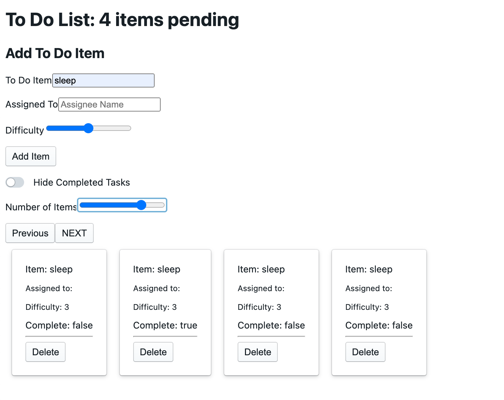

# todo-app

Created by Harvey Lucas and Roop Hayer

## Deploy URL's

Netlify: https://silly-bhabha-7968f1.netlify.app

## Summary of Problem Domain

A Web Application for securely managing a To Do List.

### Phase 2 Requirements - Lab: Class 27

Context API - Behaviors

In Phase 2, we’re going to extend the functionality of our application by allowing the user to make some decisions on how they would like the application to function. Specifically, we’ll let them make changes to 2 settings.

- Implement the Context API to make some basic application settings available to components

  - How many To Do Items to show at once

  - Whether or not to show completed items

- Provide the users with a form where they can change the values for those settings

  - This should be given in the form of a new component, perhaps linked to from the main navigation

- Save the users choices in Local Storage

- Retrieve their preferences from Local Storage and apply them to the application on startup

### Phase 1 Requirements - Lab: Class 26

In Phase 1, we're going to perform some refactoring of the To Do application as built by another team. This application mixes application state and user settings at the top level and passes things around. It was a good proof of concept, but we need to make this production ready.

- Style the application using the [Blueprint Component API](https://blueprintjs.com/docs/#blueprint)

- Properly modularize the application into separate components

- Implement the Context API to make some basic application settings available to components
  - How many To Do Items to show at once
  - Whether or not to show completed items

## Visual

